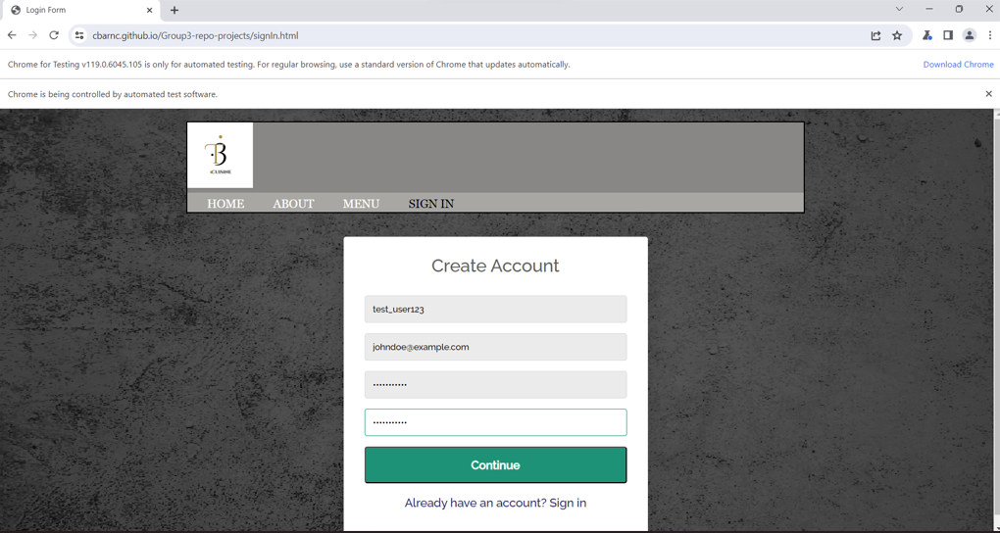
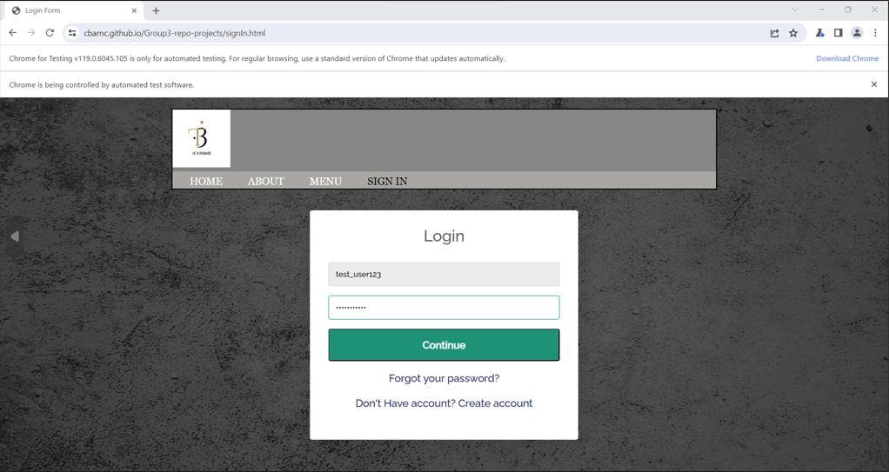
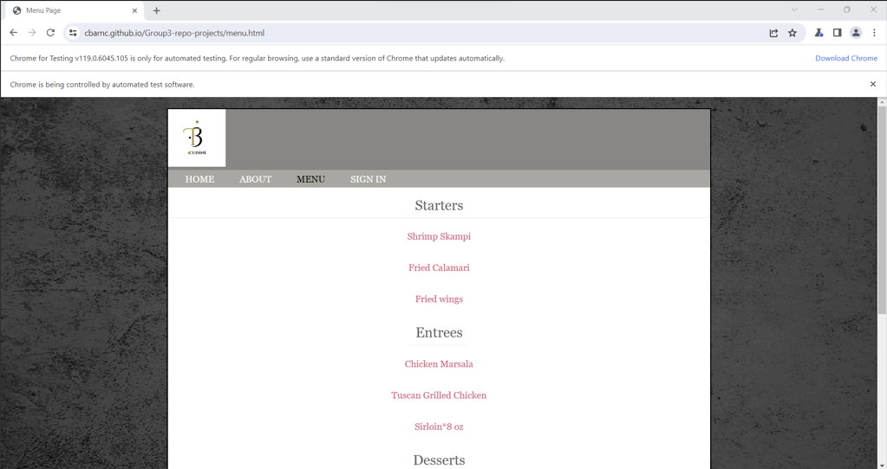
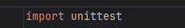
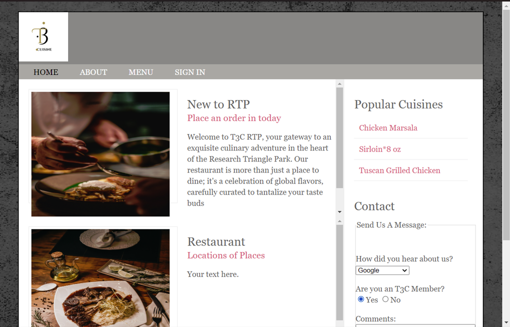
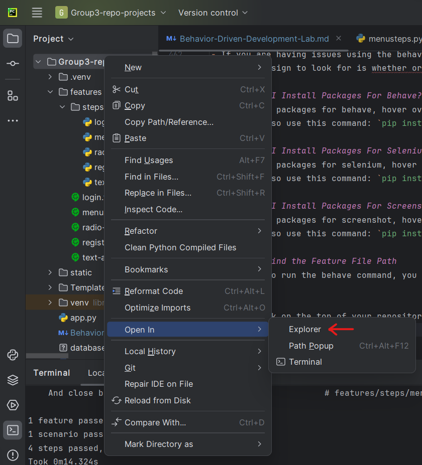
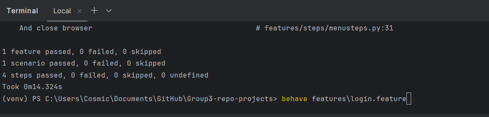

_______________________________________________________________________

	Group 3	BEHAVIOR-DRIVEN DEVELOPMENT LAB	
_______________________________________________________________________


## LAB 02	AUTOMATION WITH BEHAVE

### OBJECTIVES
- Automate browser actions for web application testing.
- Understand and utilize Selenium WebDriver using Python.
- Validate web application UI elements and functionalities.
- Create a Behave step definitions
- Provide details on commands commonly used in Behave

### PREREQUISITES
- Must have basic knowledge of software testing
- Must have knowledge on how to use locators
- Must have a basic level of knowledge of the python programming language
- Must have a basic level of knowledge of html

## BEFORE YOU GET STARTED
You will need the following in order for your tests to perform correctly

- Install a web browser to run the web application
    - This can be:
        - Firefox (Recommended)
        - Chrome
        - Microsoft Edge
- Create a GitHub account
  - Clone the GitHub repository
- Install a code editor
- Install Python
- Install Selenium
- Download a Web Driver
- Install Behave

Examples of code editors:
- VS Code
- Pycharm (Recommended)

For more information on Installations and GitHub: https://github.com/CbarNC/Group3-repo-projects/blob/Selenium/Selenium%20Lab.md

### OVERVIEW
Behave is a Python library for behavior-driven development (BDD). BDD is a software development methodology that extends test-driven development (TDD) by encouraging collaboration between developers, testers, and non-technical stakeholders like business analysts and product owners. BDD focuses on the behavior of a software system from the user's perspective and emphasizes the use of natural language to describe and document the system's functionality. The information below is a step-by-step guide on how to help you get started.

#### WHAT IS GHERKIN?
Gherkin is a plain-text, domain-specific language used to describe the behavior of software systems in a human-readable format. It is commonly associated with behavior-driven development (BDD) and is often used to write feature files that define the expected behavior of a software application from the user's perspective. Gherkin is designed to be easily understood by non-technical stakeholders, such as product owners, business analysts, and domain experts, as well as developers and testers.

#### WHAT ARE FEATURE FILES?
Feature files are written in plain text and contain scenarios that describe the expected behavior of a particular feature of your application. They typically use a structured format like Gherkin, which is a language for specifying behavior using keywords like "Given," "When," and "Then."

### Step 1: Install Behave
You can install Behave using Python's package manager, pip. Open your command prompt or terminal and run the following command:

`pip install behave`


Once installed, a "Successfully installed" message should be displayed.

- For more information on behave, visit their website at: https://behave.readthedocs.io/en/latest/

**Note:** If you find that you have problems installing behave on your computer, please navigate to the [FAQ](#faq) section of this document

## Step 3 (Do It Yourself - Write a Gherkin Feature File)
Website used for these demonstrations: https://cbarnc.github.io/Group3-repo-projects/

### Scenario 1 (User Registration)

```gherkin
Feature: User Registration
  Scenario: User can register for an account
    Given the user is on the registration page
    When the user fills in their information
    And clicks the "Register" button
    Then the user should be logged in
```
- This feature file includes syntax on how a user can register for an account on our website

### Scenario 2 (Login Functionality)

```gherkin
Feature: Login Functionality
  Scenario: User can log in with valid credentials
    Given the user is on the login page
    When they enter valid username and password
    And click the "Login" button
    Then they should be redirected to the dashboard
```
- This feature file includes syntax on how a user can log into an account on our website

### Scenario 3 (Menu Display)

```gherkin
Feature: Menu Display
  Scenario: User can view the restaurant's menu
    Given the user is on the restaurant's homepage
    When they click on the "Menu" section
    Then they should see a list of dishes and their prices
    And close browser
```
- This feature file includes syntax on how a user can display the restaurant menu on our website

### Scenario 4 (Text Area | Contact Us)

```gherkin
Feature: Contact Us Box - Text Area

  Scenario: Test the text box area
      Given The comments box is empty
      When The user selects the input box and types a message
      Then The comment box is filled
```
- This feature file includes syntax on how a user can input text in the "contact us" text area on our website

### Scenario 5 (Radio Button | Contact Us)

```gherkin
Feature: Radio Button
  Scenario: Selecting Radio Button Yes
    Given user on contact us section
    When the selects the Yes Radio button
    Then the user should see radio button yes selected

```
- This feature file includes syntax on how a user can select different types of radio buttons in the "contact us" section on our website

## Step 4 (Do It Yourself - Implement Step Definitions)

- In order for us to implement our feature files for automated testing, we have to create step definitions with the behave and selenium libraries in python

### Scenario 1 (Test Registration)

```Python
from behave import *
from selenium import webdriver
from selenium.webdriver.common.by import By
import time
from PIL import Image


@given('the user is on the registration page')
def user_on_registration(context):
  context.driver = webdriver.Chrome()
  context.driver.maximize_window()
  context.driver.get('https://cbarnc.github.io/Group3-repo-projects/signIn.html')
  create_account_link = context.driver.find_element(By.ID, "linkCreateAccount")
  create_account_link.click()
  time.sleep(5)


@when('the user fills in their information')
def user_fills_information(context):
  context.driver.find_element(By.ID, "signupUsername").send_keys("test_user123")
  time.sleep(2)
  context.driver.find_element(By.ID, "signupEmailaddress").send_keys("johndoe@example.com")
  time.sleep(2)
  context.driver.find_element(By.ID, "signupPassword").send_keys("password123")
  time.sleep(2)
  context.driver.find_element(By.ID, "signupConfirmPassword").send_keys("password123")
  time.sleep(2)
  screenshot = Image.open("BrowserScreenshots/screenshot1.png")
  screenshot.show()


@when('clicks the "Register" button')
def click_register(context):
  submit_confirm = context.driver.find_element(By.ID, "signupSubmit")
  submit_confirm.click()
  time.sleep(5)


@then('the user should be logged in')
def redirect(context):
  context.driver.get("https://cbarnc.github.io/Group3-repo-projects/")

```
### BREAKDOWN 1 -

- **Import Statements**
    - `behave`: The behave library
    - `selenium`: The web testing library
    - `webdriver`: The WebDriver module for implementation
    - `By`: Module that allows for locating elements on a webpage
    - `Keys`: Module that allows for keyboard interactions
    - `time`: Module that deals with time
    - `Screenshot`: Module for taking screenshots
    - `Image`: From the Python Imaging Library (PIL): Used for working with images
- **Step Definitions** 
  - *user_on_registration*
    - The `@given` decorator, represents the context of the test
    - It opens a Chrome web browser using Selenium's `webdriver.Chrome()` and navigates to a specific URL
    - It finds an element on the page with the ID "linkCreateAccount" and clicks on it
    - It then adds a delay of 5 seconds using `time.sleep(5)`
  - *user_fills_information*
    - The `@when` decorator, represents the action of the user filling in their information
    - It finds elements on the page with the IDs "signupUsername", "signupEmailaddress", "signupPassword", "signupConfirmPassword" and enters values into them
    - It adds delays of 2 seconds between actions
    - It uses the `Screenshot` class to capture a screenshot and display it using PIL
  - *click_register*
    - The `@when` decorator, represents the action of the user clicking the "Register" button
    - It finds an element on the page with the ID "signupSubmit" and clicks on it
  - *user_login*
    - The `@then` decorator, represents the expected outcome of the test, where the user should be logged in
    - It navigates to the login page using `context.driver.get()`

### Scenario 2 (Test Login)

```Python
from behave import *
from selenium import webdriver
from selenium.webdriver.common.by import By
import time
from PIL import Image


@given('the user is on the login page')
def login_page(context):
  context.driver = webdriver.Chrome()
  context.driver.maximize_window()
  context.driver.get("https://cbarnc.github.io/Group3-repo-projects/signIn.html")


@when('they enter valid username and password')
def user_pass(context):
  ui = "test_user123"
  pi = "password123"
  context.driver.find_element(By.ID, 'login-username').send_keys(ui)
  time.sleep(2)
  context.driver.find_element(By.ID, 'login-password').send_keys(pi)
  time.sleep(2)
  screenshot = Image.open("BrowserScreenshots/screenshot2.png")
  screenshot.show()


@when('click the "Login" button')
def click_login(context):
  login_button = context.driver.find_element(By.ID, 'login-submit')
  login_button.click()
  time.sleep(5)


@then('they should be redirected to the dashboard')
def redirect(context):
  context.driver.get("https://cbarnc.github.io/Group3-repo-projects/")

```
### BREAKDOWN 2 -

- **Step Definitions**
  - *login_page*
    - The `@given` decorator, represents the context of the test
    - It opens a Chrome web browser using Selenium's `webdriver.Chrome()` and navigates to a specific URL
  - *user_pass*
    - The `@when` decorator, represents the action of the user entering their username and password
    - It finds elements on the page with the IDs "login-username" and "login-password" and enters values into them
    - It uses the `Screenshot` class to capture a screenshot and display it using PIL
  - *click_login*
    - The `@when` decorator, represents the action of the user clicking the "Login" button
    - It finds an element on the page with the ID "login-submit" and clicks on it
  - *redirect*
    - The `@then` decorator, represents the expected outcome of the test, where the user should be redirected to the dashboard
    - It navigates to the homepage using `context.driver.get`

### Scenario 3 (Test Menu Display)

```Python
import time
from behave import *
from selenium import webdriver
from selenium.webdriver.common.by import By
from PIL import Image


@given('the user is on the restaurant\'s homepage')
def home_page(context):
  context.driver = webdriver.Chrome()
  context.driver.maximize_window()
  context.driver.get("https://cbarnc.github.io/Group3-repo-projects/")


@when('they click on the "Menu" section')
def open_menu(context):
  menu_button = context.driver.find_element(By.LINK_TEXT, 'MENU')
  menu_button.click()
  time.sleep(2)


@then('they should see a list of dishes and their prices')
def menu_list(context):
  menu_elements = context.driver.find_elements(By.CLASS_NAME, 'menu')
  assert len(menu_elements) > 0, "No 'menu' elements found on the page"
  time.sleep(2)
  screenshot = Image.open("BrowserScreenshots/screenshot3.png")
  screenshot.show()


@then('close browser')
def close_browser(context):
  context.driver.close()

```
### BREAKDOWN 3 -

- **Step Definitions**
  - *home_page*
    - The `@given` decorator, represents the context of the test
    - It opens a Chrome web browser using Selenium's `webdriver.Chrome()` and navigates to a specific URL
  - *open_menu*
    - The `@when` decorator, represents the action of the user clicking the "Menu" section
    - It finds elements on the page with the class name "menu" and determines whether the menu page has items or not
  - *menu_list*
    - The `@then` decorator, represents the action of the user seeing a list of menu dishes and their prices
    - It finds an element on the page with the class name 'menu'
    - It uses the `Screenshot` class to capture a screenshot and display it using PIL
  - *close_browser*
    - The `@then` decorator, represents the expected outcome of the test, where the browser should be closed
    - It closes the browser using `context.driver.close()`

### Scenario 4 (Text Area | Contact US)

```Python
import time
from Screenshot import *
from behave import *
from selenium import webdriver
from selenium.webdriver.common.by import By
from PIL import Image


@given('The comments box is empty')
def empty_comments(context):
  context.driver = webdriver.Chrome()
  context.driver.maximize_window()
  context.driver.get('https://cbarnc.github.io/Group3-repo-projects/')
  assert context.driver.find_element(By.ID, 'comments').text == ''
  # takes a screenshot of the empty text area before user writes
  ob = Screenshot.Screenshot()
  img_url = ob.full_screenshot(context.driver, save_path=r'.', image_name='myimage2.png', is_load_at_runtime=True,
                               load_wait_time=0)
  screenshot = Image.open(img_url)
  screenshot.show()


@when(u'The user selects the input box and types a message')
def test_message(context):
  sendMessage = "This is a Test Message"
  context.driver.find_element(By.ID, 'comments').send_keys(sendMessage)
  time.sleep(3)
  ob = Screenshot.Screenshot()
  img_url2 = ob.full_screenshot(context.driver, save_path=r'.', image_name='myimage.png', is_load_at_runtime=True,
                                load_wait_time=0)
  print(img_url2)


# takes a screenshot of message user wrote
@then(u'The comment box is filled')
def message_status(context):
  screenshot = Image.open("BrowserScreenshots/myimage.png")
  screenshot.show()

```

### BREAKDOWN 4 -

- **Step Definitions**
  - *empty_comments*
    - The `@given` decorator, represents the context of the test
    - It opens a Chrome browser, navigates to a specific URL, and asserts that the comments box is initially empty
    - It uses the `Screenshot` class to capture a screenshot and display it using PIL
  - *test_message*
    - The `@when` decorator, represents the action of the user selecting the input box and typing a message
    - It captures a screenshot after the user has typed a message using the `Screenshot` class
  - *message_status*
    - The `@then` decorator, represents the expected outcome of the test, where the application takes a screenshot of what the user wrote
    - This is a visual check to confirm that the comments box is filled as expected

### Scenario 5 ( Radio Button | Contact Us)

```Python
from behave import *
from selenium import webdriver
from selenium.webdriver.common.by import By
import time
from PIL import Image


@given('user on contact us section')
def contact_us(context):
  context.driver = webdriver.Chrome()
  context.driver.maximize_window()
  context.driver.get('https://cbarnc.github.io/Group3-repo-projects/')


@when('the selects the Yes Radio button')
def select_button(context):
  radio_list = context.driver.find_elements(By.NAME, "T3C_member")
  for radioButton in radio_list:
    radioButton_t = radioButton.get_attribute("value")
    if radioButton_t == "yes":
      radioButton.click()
      time.sleep(2)


@then('the user should see radio button yes selected')
def radio_status(context):
  context.driver.get("https://cbarnc.github.io/Group3-repo-projects/")
  screenshot = Image.open("BrowserScreenshots/screenshot-2.png")
  screenshot.show()

```

### BREAKDOWN 5 -

- **Step Definitions**
  - *contact_us*
    - The `@given` decorator, represents the context of the test
    - It opens a Chrome browser, navigates to a specific URL
  - *select_button*
    - The `@when` decorator, represents the action of the user selecting the "yes" radio button
    - It finds elements on the page with the name "T3C_member"
    - The application iterates through them, and clicks the one with the value "yes". It then sleeps for 2 seconds
  - *radio_status*
    - The `@then` decorator, represents the expected outcome of the test, where the user should see the "yes" radio button selected
    - It opens the specified URL and then attempts to open a screenshot file named "screenshot-2.png" using PIL and displays it

## Step 5 (Do It Yourself - Run Behave Tests)

- In order for you to run your behave tests you must be in the terminal of your code editor

The command for running your tests are below:

`behave features\"Feature File Name"`

- To find the feature file path, navigate to the [FAQ](#faq) section of the document. 

## Feature File Screenshots

### Registration


### Login


### Menu Display


### Text-Area (Contact Us)



### Radio-Button (Contact Us)


## FAQ (Frequently Asked Questions)
 <a id="faq"></a>

### Installing Packages

- If you are having issues using the behave, selenium, and the screenshot libraries, you might need to install them before running the behave tests.
- The first sign to look for is whether or not your libraries have red lines underneath (this is an indicator that you might need to install packages)

#### How do I Install Packages For Behave?
- To install packages for behave, hover over the behave library and select "install packages"
- You can also use this command: `pip install behave`

#### How do I Install Packages For Selenium?
- To install packages for selenium, hover over the selenium library and select "install packages"
- You can also use this command: `pip install selenium`

#### How do I Install Packages For Screenshot?
- To install packages for screenshot, hover over the image library and select "install packages"
- You can also use this command: `pip install Selenium-Screenshot`

### How to Find the Feature File Path
- In order to run the behave command, you need to find the feature file path. 

Step 1:
- Right-click on the top of your repository and click "Open In > Explorer"


- Click into the folder of your repository and navigate to where you saved your `.feature` files

**Example:**

