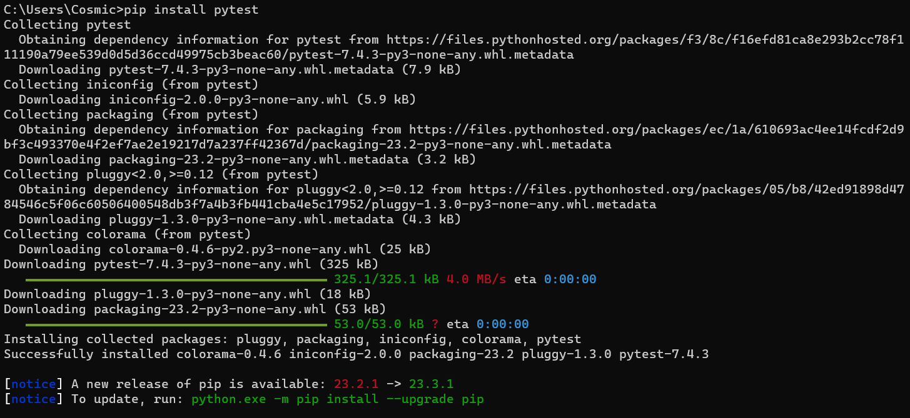

_______________________________________________________________________

	Group 3	Test-Driven Development LAB	
_______________________________________________________________________


## LAB 03	UNIT TESTING WITH TEST-DRIVEN DEVELOPMENT

### OBJECTIVES
- Understand unit testing using Python.
- Create pytest functions
- Provide details on commands commonly used in Behave

### PREREQUISITES
- Must have basic knowledge of software testing
- Must have a basic level of knowledge of the python programming language

## BEFORE YOU GET STARTED
You will need the following in order for your tests to perform correctly

- Create a GitHub account
  - Clone the GitHub repository
- Install a code editor
- Install python
- Install pytest

Examples of code editors:
- VS Code
- Pycharm (Recommended)

For more information on Installations and GitHub: https://github.com/CbarNC/Group3-repo-projects/blob/Selenium/Selenium%20Lab.md

### OVERVIEW
Test Driven Development (TDD) is the process of using unit testing to write automated test functions before writing the actual code. To achieve this, TDD uses multiple libraries with different languages, but in the lab, we will be focusing on the pytest library with python. The information below is a step-by-step guide on how to help you get started.

### What is Unit Testing?
Unit Testing is the process of checking small pieces of code to deliver information early and often

### Three Phases of TDD
1. **Red**: Think about what you want to develop
2. **Green**: Think about how to make your tests pass
3. **Refactor**: Think about how to improve your existing implementation

### Step 1: Install Pytest
You can install pytest using Python's package manager, pip. Open your command prompt or terminal and run the following command:

`pip install pytest`



Once installed, a "Successfully installed" message should be displayed.

- For more information on pytest, visit their website at: https://docs.pytest.org/en/7.1.x/contents.html

Note: If you find that you have problems installing behave on your computer, please navigate to the [FAQ](#faq) section of this document

###  Step 2 (RED STAGE)
The purpose of this phase is to write a test that informs the implementation of a feature.

Here is an example of the "in the red" stage:
/s1.gif)


###  Step 3 (GREEN STAGE)
The purpose of this phase is to 

Here is an example of the "in the green" stage:
/s2.gif)

###  Step 4 (REFACTOR STAGE)
The purpose of this phase is to implement code that make your tests pass.

Here is an example of the "in the green refactor" stage:


###  Step 5 (Writing a Test File For the Signup Page)
Here is a breakdown of the registration_testing.py file:

```python


```

## FAQ (Frequently Asked Questions)
 <a id="faq"></a>
